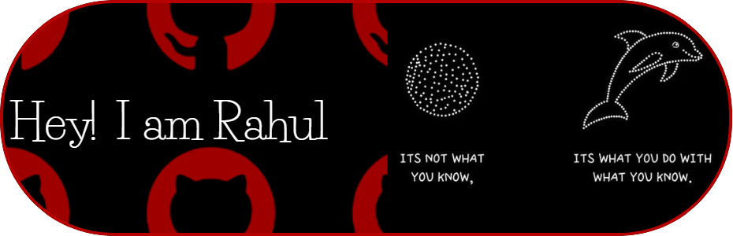

<h1 align="center">Holaaa😉✌️... I'm Rahul Krishna K R</h1>
<h3 align="center">A Passionate Coder from India 🇮🇳</h3>

  

 
   

---

- 🎓 Studying **Data Science @** [Mar Athanasius College of Engineering](https://mace.ac.in)  
- 🎬 Director @ **[ENCIDE MACE](https://encidemace.xyz)**  
- 🌱 Currently learning **Data Analytics, DSA**  
- 💬 Ask me about **Front-End, Python**  
- 📧 Reach me at: **rahulkridhna@gmail.com**  

<h3 align="left">🌐 Connect with me:</h3>

  
  
  
  
  

<h3 align="left">⚙️ Languages and Tools:</h3>

   
   
   
   
   
   
   
   
   
   

---

&nbsp;

---
<!-- my-badges start -->
<h4><a href="https://github.com/my-badges/my-badges">My Badges</a></h4>

<!-- my-badges end -->
---

<!--START_SECTION:activity-->
<!--END_SECTION:activity-->
---

---

  🚀 Ready to collaborate or just have a chat? Let's connect and build something cool! 😄  
  Made with ❤️ by <a href="https://github.com/rahulkrishnakr">Rahul Krishna K R</a>

  

  
  

